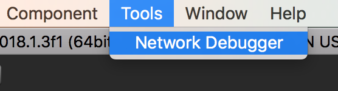
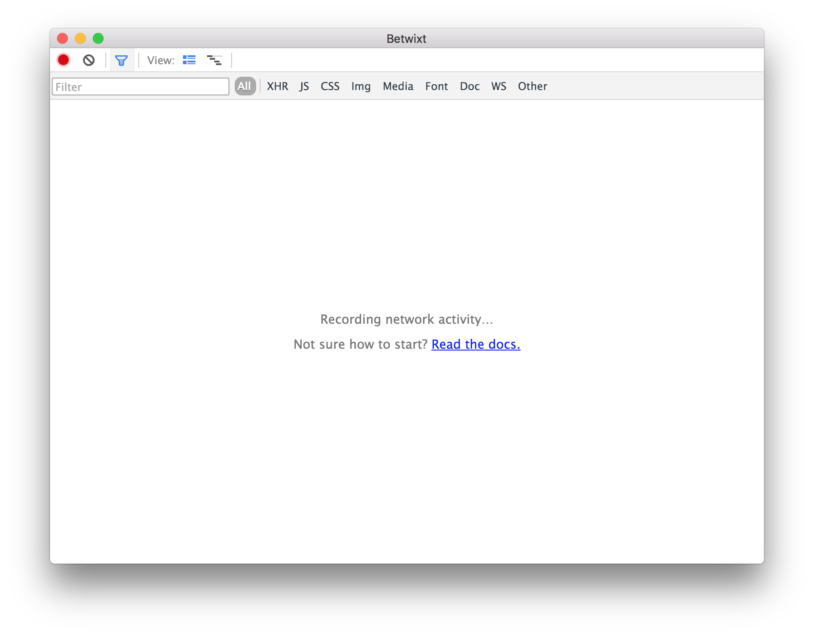
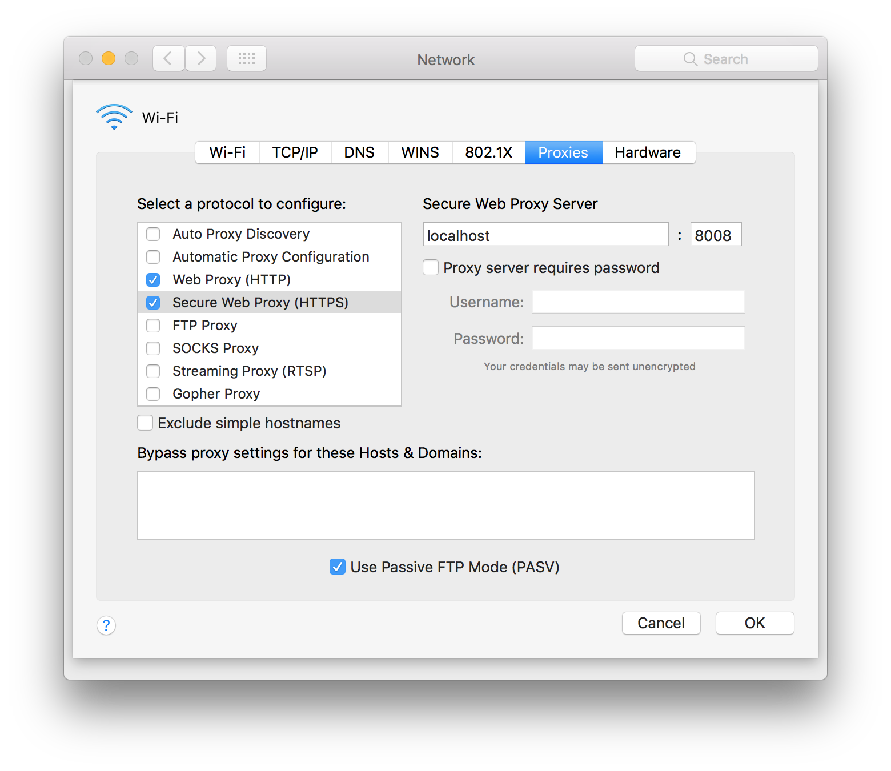
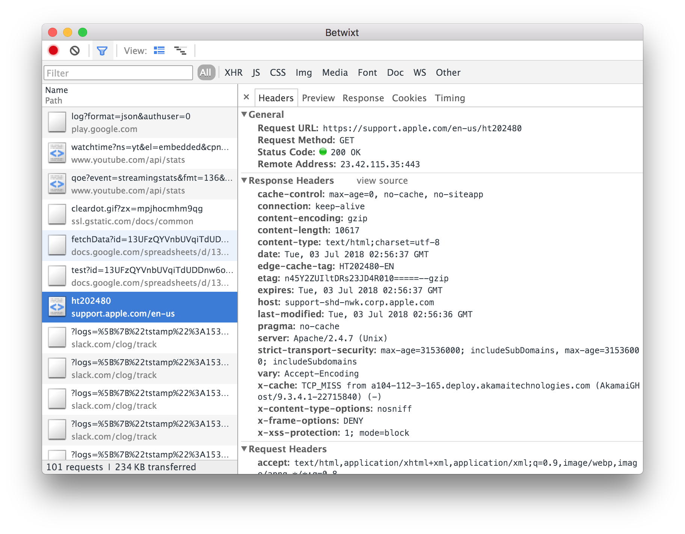

# Unity Network Debugger

Debug common network traffic with Chrome DevTools interface.

# How it works

It uses [Betwixt](https://github.com/kdzwinel/betwixt) as mitm proxy interface to capture desired network traffic.

# Installation

#### Step 1: Copy `Editor` folder from this repository into your `Assets` folder.

This will create a menu item under `Tools`. It will try to download `Betwixt` for the first run.

#### Step 2: Create new network location

https://support.apple.com/en-us/ht202480

#### Step 3: Setup the proxy for created location

https://kb.k12usa.com/knowledgebase/proxy-settings-on-a-mac-os-x

Enter `localhost` for the server and `8008` for the port.

#### [Optional] Setup 4: Install certificate if you want to capture encrypted traffic (HTTPS)

https://github.com/kdzwinel/betwixt/blob/master/docs/https.md

# Usage

Open network debugger, switch to the new network location and done!

